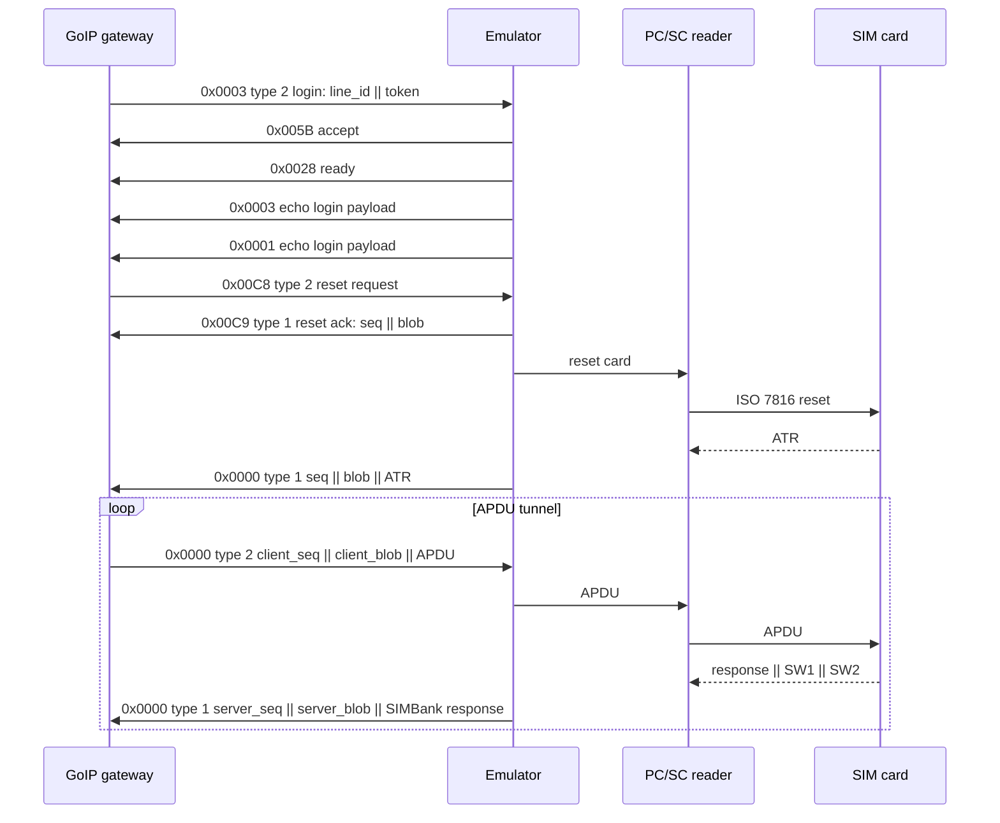
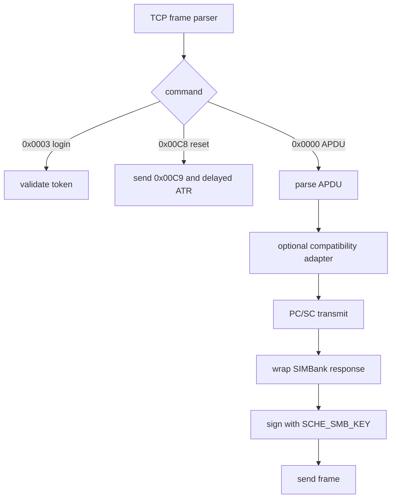

# Protocol Notes

This document uses test values only:

- SIMBank IP: `192.0.2.10`
- `SMB_ID=1001`
- `SMB_KEY=lab-smb-key`
- `SCHE_SMB_ID=200`
- `SCHE_SMB_KEY=lab-sche-key`

## TCP Frame

Every GoIP/SIMBank message starts with the same 12-byte little-endian header.

| Offset | Size | Field | Notes |
| --- | ---: | --- | --- |
| 0 | 4 | magic | `78 56 21 43` |
| 4 | 4 | line_id | `SMB_ID * 100 + slot` |
| 8 | 2 | command | Little-endian command id |
| 10 | 2 | type | Direction/type field |
| 12 | n | payload | Command-specific bytes |

For example, slot 1 with `SMB_ID=1001` uses `line_id=100101`.

## Session Flow



## Line ID Generation

```text
line_id = SMB_ID * 100 + slot
```

`slot` is the 1-based GoIP channel number. The emulator derives the slot from
incoming frames as `line_id % 100`.

## Signed 32-bit Formatting

All MD5 formulas use the same C-style string formatting:

```python
def signed32_dec(n):
    n = n & 0xffffffff
    return str(n - 0x100000000 if n >= 0x80000000 else n)
```

Hex values are lowercase, unsigned, and have no `0x` prefix.

## GoIP to SIMBank Authentication

Login token, command `0x0003` type `0x0002`:

```text
token = MD5(SMB_KEY + signed32_dec(line_id) + hex(line_id))
payload = le32(line_id) || token
```

APDU request blob, command `0x0000` type `0x0002`:

```text
client_blob = MD5(SMB_KEY + signed32_dec(client_seq) + hex(line_id))
payload = le32(client_seq) || client_blob || apdu
```

## SIMBank to GoIP Reset Ack

Command `0x00C9` type `0x0001` uses a slot-derived sequence number:

```text
c9_seq  = 0x0004E608 + slot
c9_blob = MD5(SCHE_SMB_KEY + signed32_dec(c9_seq) + hex(c9_seq))
payload = le32(c9_seq) || c9_blob
```

## SIMBank to GoIP APDU Response

The SIMBank-side local id is independent from the GoIP line id:

```text
local_id = SCHE_SMB_ID * 1000 + slot
server_blob = MD5(SCHE_SMB_KEY + signed32_dec(server_seq) + hex(local_id))
payload = le32(server_seq) || server_blob || simbank_response
```

The emulator initializes `server_seq` per line from the current millisecond
counter and then increments it by one for each server APDU frame.

## APDU Response Wrapping

PC/SC returns:

```text
data || sw1 || sw2
```

For valid APDU commands, SIMBank wire format prefixes the response with the
request INS byte:

```text
simbank_response = ins || data || sw1 || sw2
```

## Reset and ATR Delay

Some GoIP remote-SIM modem firmware rejects an ATR delivered immediately after
`0x00C9`. The full emulator sends `0x00C9` first, resets the card, waits
`GOIP_ATR_DELAY` seconds, and only then pushes the unsolicited ATR in a
`0x0000` type `0x0001` frame. The default is `6` seconds.

## Compatibility Adapters

The transparent engine has optional adapters for older GoIP behavior:

- `--adf-context-adapter` selects the real USIM ADF before forwarding reserved ADF paths.
- `--profile-overlay` can provide a coherent lab operator profile for non-cryptographic EFs.
- `--derived-profile-adapter` can fill empty display/preferred-PLMN EFs from IMSI-derived data.
- `--compact-profile-fcp` and `--compat-fcp` can return compact FCP templates for selected files.
- `--fcp-size-cap` can cap selected FCP sizes for legacy firmware, but it is off by default.

## Implementation Map


