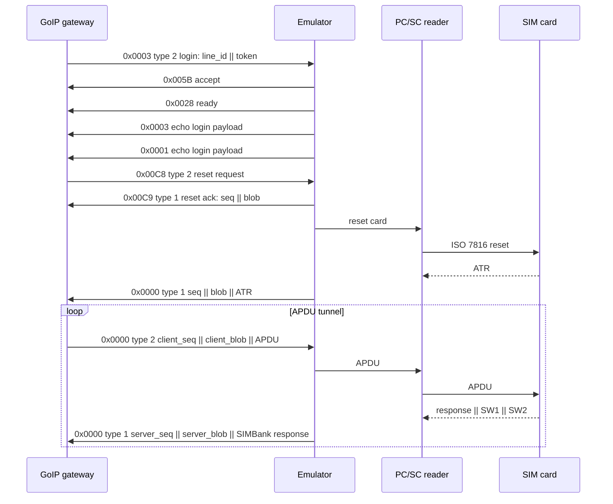
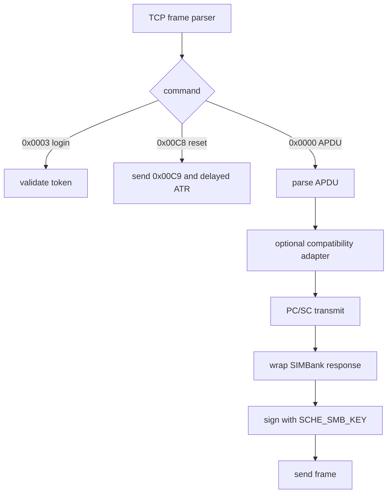

# Описание протокола

В документе используются только тестовые значения:

- IP SIMBank: `192.0.2.10`
- `SMB_ID=1001`
- `SMB_KEY=lab-smb-key`
- `SCHE_SMB_ID=200`
- `SCHE_SMB_KEY=lab-sche-key`

## TCP-кадр

Каждое сообщение GoIP/SIMBank начинается с 12-байтового little-endian заголовка.

| Offset | Size | Field | Notes |
| --- | ---: | --- | --- |
| 0 | 4 | magic | `78 56 21 43` |
| 4 | 4 | line_id | `SMB_ID * 100 + slot` |
| 8 | 2 | command | little-endian command id |
| 10 | 2 | type | direction/type field |
| 12 | n | payload | command-specific bytes |

Например, slot 1 при `SMB_ID=1001` использует `line_id=100101`.

## Session Flow



## Генерация Line ID

```text
line_id = SMB_ID * 100 + slot
```

`slot` это 1-based номер канала GoIP. Эмулятор получает slot из входящего
кадра как `line_id % 100`.

## Signed 32-bit Formatting

Все MD5-формулы используют одинаковое C-style строковое представление:

```python
def signed32_dec(n):
    n = n & 0xffffffff
    return str(n - 0x100000000 if n >= 0x80000000 else n)
```

Hex-значения пишутся lowercase, unsigned и без префикса `0x`.

## GoIP to SIMBank Authentication

Login token, команда `0x0003` type `0x0002`:

```text
token = MD5(SMB_KEY + signed32_dec(line_id) + hex(line_id))
payload = le32(line_id) || token
```

APDU request blob, команда `0x0000` type `0x0002`:

```text
client_blob = MD5(SMB_KEY + signed32_dec(client_seq) + hex(line_id))
payload = le32(client_seq) || client_blob || apdu
```

## SIMBank to GoIP Reset Ack

Команда `0x00C9` type `0x0001` использует sequence от номера slot:

```text
c9_seq  = 0x0004E608 + slot
c9_blob = MD5(SCHE_SMB_KEY + signed32_dec(c9_seq) + hex(c9_seq))
payload = le32(c9_seq) || c9_blob
```

## SIMBank to GoIP APDU Response

Локальный SIMBank id независим от внешнего GoIP line id:

```text
local_id = SCHE_SMB_ID * 1000 + slot
server_blob = MD5(SCHE_SMB_KEY + signed32_dec(server_seq) + hex(local_id))
payload = le32(server_seq) || server_blob || simbank_response
```

Эмулятор инициализирует `server_seq` для каждого line из текущего millisecond
counter, затем увеличивает его на один для каждого server APDU frame.

## APDU Response Wrapping

PC/SC возвращает:

```text
data || sw1 || sw2
```

Для валидных APDU SIMBank wire format добавляет перед ответом INS исходной
команды:

```text
simbank_response = ins || data || sw1 || sw2
```

## Reset и ATR Delay

Некоторые версии GoIP remote-SIM modem firmware не принимают ATR, если отправить
его сразу после `0x00C9`. Full emulator сначала отправляет `0x00C9`, затем
делает reset карты, ждет `GOIP_ATR_DELAY` секунд и только после этого пушит ATR
в unsolicited frame `0x0000` type `0x0001`. Значение по умолчанию: `6` секунд.

## Compatibility Adapters

Transparent engine содержит опциональные адаптеры под старое поведение GoIP:

- `--adf-context-adapter` выбирает реальный USIM ADF перед reserved ADF paths.
- `--profile-overlay` может отдать согласованный lab operator profile для non-cryptographic EFs.
- `--derived-profile-adapter` может заполнить пустые display/preferred-PLMN EFs из IMSI-derived данных.
- `--compact-profile-fcp` и `--compat-fcp` могут вернуть compact FCP templates для выбранных файлов.
- `--fcp-size-cap` может ограничить FCP sizes для legacy firmware, но по умолчанию выключен.

## Implementation Map


